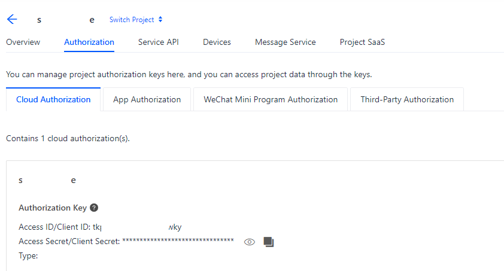
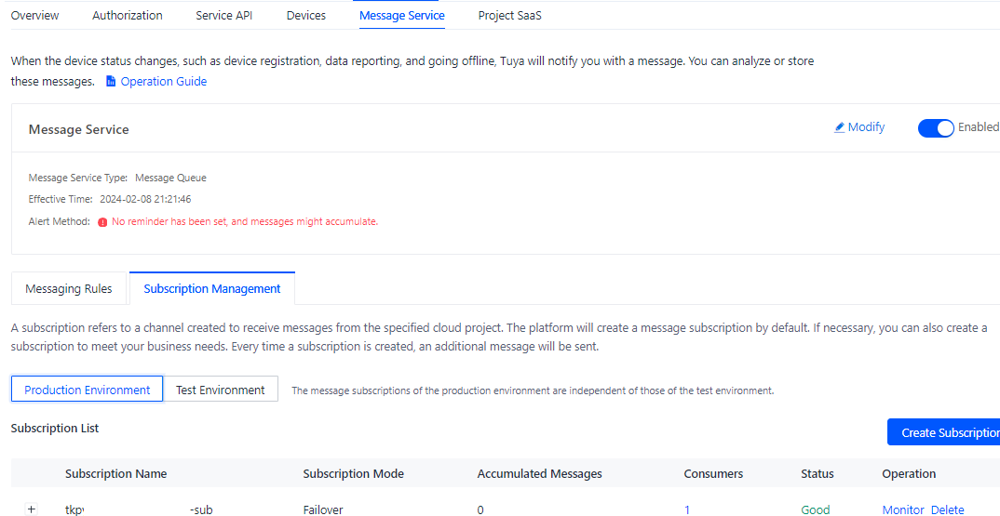

# mySmartLife

J'en avait marre de ne pas arriver à gérer facilement mes deux boutons Zigbee, 

le click, le double_click n'arrivait pas au bon moment, et impossible de déclencher des automations.

Donc voici une petite contribution pour gérer cela.

Les sensors sont créés automatiquement, 

exemple : bouton de type : qgwcxxws un click est reçu, met à jour le sensor et 2 secondes après remet le statut en unknown, ce qui permet de recevoir les nouveaux events.

Pour le moment, la gestion uniquement possible via le fichier yaml, 

mais plus tard, il sera possible de le faire via les écrans de configs

Type de sensor géré à ce jour : qgwcxxws

config yaml
```
- platform: mySmartLife
  ACCESS_ID: xxx
  ACCESS_KEY: xxx
  MQ_ENDPOINT: wss://mqe.tuyaeu.com:8285/
```
ACCESS_ID & ACCESS_KEY à récupérer sur votre acces https://iot.tuya.com/

pour les obtenir, vous devez avoir un projet( à créé ici : https://iot.tuya.com/cloud/ de type smart home )

une fois créé vous aurez accès à l'acces_id + acces_key 



il faudra ensuite créé une subscription dans message service : 



MQ_ENDPOINT : si votre tuya utilise le datacenter européen

